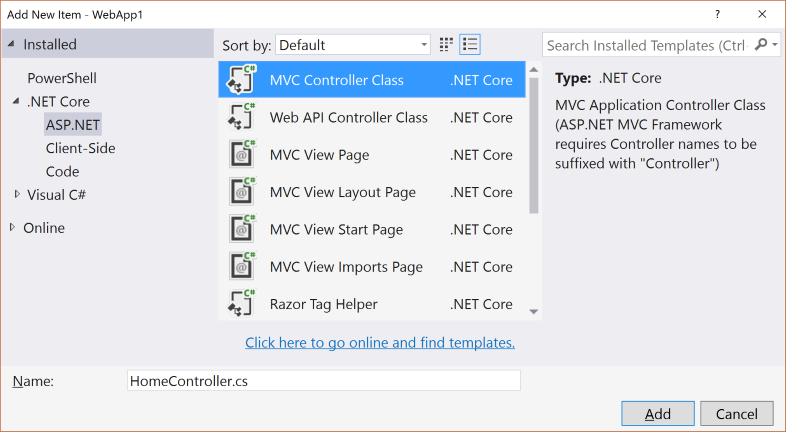
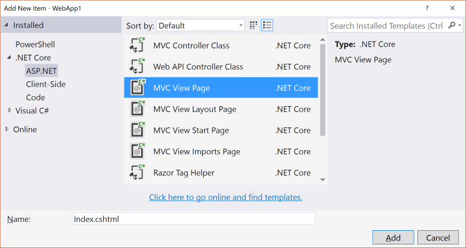
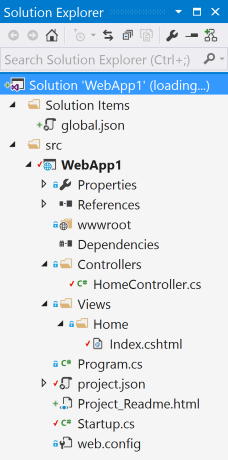
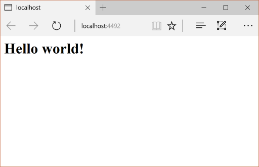
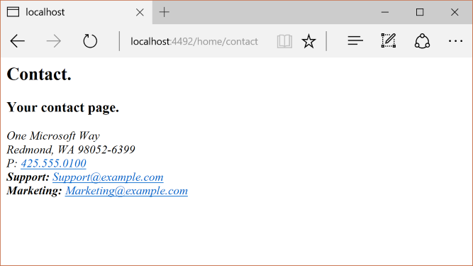
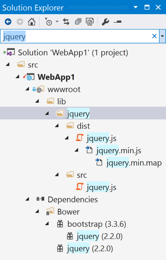
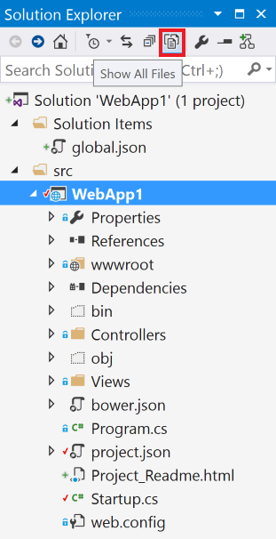

>[!WARNING]
> This page documents version 1.0.0-rc2 and has not yet been updated for version 1.0.0

# Migrating From ASP.NET MVC to ASP.NET Core MVC

By [Rick Anderson](https://twitter.com/RickAndMSFT), [Daniel Roth](https://github.com/danroth27), [Steve Smith](http://ardalis.com) and [Scott Addie](https://scottaddie.com)

This article shows how to get started migrating an ASP.NET MVC project to [ASP.NET Core MVC](../mvc/index.md). In the process, it highlights many of the things that have changed from ASP.NET MVC. Migrating from ASP.NET MVC is a multiple step process and this article covers the initial setup, basic controllers and views, static content, and client-side dependencies. Additional articles cover migrating configuration and identity code found in many ASP.NET MVC projects.

## Create the starter ASP.NET MVC project

To demonstrate the upgrade, we'll start by creating a ASP.NET MVC app. Create it with the name *WebApp1* so the namespace will match the ASP.NET Core project we create in the next step.


*Optional:* Change the name of the Solution from *WebApp1* to *Mvc5*. Visual Studio will display the new solution name (*Mvc5*), which will make it easier to tell this project from the next project.

## Create the ASP.NET Core project

Create a new *empty* ASP.NET Core web app with the same name as the previous project (*WebApp1*) so the namespaces in the two projects match. Having the same namespace makes it easier to copy code between the two projects. You'll have to create this project in a different directory than the previous project to use the same name.


* *Optional:* Create a new ASP.NET Core app named *WebApp1* with authentication set to **Individual User Accounts**. Rename this app *FullAspNetCore*.  Creating this project will save you time in the conversion. You can look at the template generated code to see the end result or to copy code to the conversion project. It's also helpful when you get stuck on a conversion step to compare with the template generated project.

## Configure the site to use MVC

Open the *project.json* file.

* Add `Microsoft.AspNetCore.Mvc` and `Microsoft.AspNetCore.StaticFiles` to the `dependencies` property:

* Add the "prepublish" line to the "scripts" section:

````JavaScript

   "scripts": {
      "prepublish": [ "npm install", "bower install", "gulp clean", "gulp min" ],
          "postpublish": [ "dotnet publish-iis
            --publish-folder %publish:OutputPath%
            --framework %publish:FullTargetFramework%" ]
   }
   ````

* `Microsoft.AspNetCore.Mvc` Installs in the ASP.NET Core MVC framework package

* `Microsoft.AspNetCore.StaticFiles` is the static file handler. The ASP.NET runtime is modular, and you must explicitly opt in to serve static files (see [Working with Static Files](../fundamentals/static-files.md)).

* The "scripts"/"prepublish" line is needed for Gulp, Bower and NPM. We'll talk about that later.

* Open the *Startup.cs* file and change the code to match the following:

<!-- literal_block {"xml:space": "preserve", "source": "migration/mvc/samples/WebApp1/src/WebApp1/Startup.cs", "ids": [], "linenos": false, "language": "c#", "highlight_args": {"hl_lines": [7, 13, 14, 15, 16, 17, 18, 19, 20, 21, 22, 23, 24], "linenostart": 1}} -->

````c#


   public class Startup
   {
       // This method gets called by the runtime. Use this method to add services to the container.
       // For more information on how to configure your application, visit http://go.microsoft.com/fwlink/?LinkID=398940
       public void ConfigureServices(IServiceCollection services)
       {
           services.AddMvc();
       }

       // This method gets called by the runtime. Use this method to configure the HTTP request pipeline.
       public void Configure(IApplicationBuilder app)
       {
           app.UseStaticFiles();

           app.UseMvc(routes =>
           {
               routes.MapRoute(
                   name: "default",
                   template: "{controller=Home}/{action=Index}/{id?}");
           });
       }
   }


   ````

`UseStaticFiles` adds the static file handler. As mentioned previously, the ASP.NET runtime is modular, and you must explicitly opt in to serve static files. `app.UseMvc(routes =>` adds routing. For more information, see [Application Startup](../fundamentals/startup.md) and [Routing](../fundamentals/routing.md).

## Add a controller and view

In this section, you'll add a minimal controller and view to serve as placeholders for the ASP.NET MVC controller and views you'll migrate in the next section.

* Add a *Controllers* folder.

* Add an **MVC controller class** with the name *HomeController.cs* to the *Controllers* folder.



* Add a *Views* folder.

* Add a *Views/Home* folder.

* Add an *Index.cshtml* MVC view page to the *Views/Home* folder.



The project structure is shown below:



Replace the contents of the *Views/Home/Index.cshtml* file with the following:

````html

   <h1>Hello world!</h1>
   ````

Run the app.



See [Controllers](../mvc/controllers/index.md) and [Views](../mvc/views/index.md) for more information.

Now that we have a minimal working ASP.NET Core project, we can start migrating functionality from the ASP.NET MVC project. We will need to move the following:

* client-side content (CSS, fonts, and scripts)

* controllers

* views

* models

* bundling

* filters

* Log in/out, identity (This will be done in the next tutorial.)

## Controllers and views

* Copy each of the methods from the ASP.NET MVC `HomeController` to the new `HomeController`. Note that in ASP.NET MVC, the built-in template's controller action method return type is [ActionResult](https://msdn.microsoft.com/en-us/library/system.web.mvc.actionresult(v=vs.118).aspx); in ASP.NET Core MVC the actions return [IActionResult](https://docs.asp.net/projects/api/en/latest/autoapi/Microsoft/AspNetCore/Mvc/IActionResult/index.html) instead. `ActionResult` implements `IActionResult`, so there is no need to change the return type of your action methods.

* Copy the *About.cshtml*, *Contact.cshtml*, and *Index.cshtml* Razor view files from the ASP.NET MVC project to the ASP.NET Core project.

* Run the ASP.NET Core app and test each method. We haven't migrated the layout file or styles yet, so the rendered views will only contain the content in the view files. You won't have the layout file generated links for the `About` and `Contact` views, so you'll have to invoke them from the browser (replace **2468** with the port number used in your project).

  * http://localhost:2468/home/about

  * http://localhost:2468/home/contact



Note the lack of styling and menu items. We'll fix that in the next section.

## Static content

In previous versions of  ASP.NET MVC, static content was hosted from the root of the web project and was intermixed with server-side files. In ASP.NET Core, static content is hosted in the *wwwroot* folder. You'll want to copy the static content from your old ASP.NET MVC app to the *wwwroot* folder in your ASP.NET Core project. In this sample conversion:

* Copy the *favicon.ico* file from the old MVC project to the *wwwroot* folder in the ASP.NET Core project.

The old ASP.NET MVC project uses [Bootstrap](http://getbootstrap.com/) for its styling and stores the Bootstrap files in the *Content* and *Scripts* folders. The template-generated old ASP.NET MVC project references Bootstrap in the layout file (*Views/Shared/_Layout.cshtml*). You could copy the *bootstrap.js* and *bootstrap.css* files from the ASP.NET MVC project to the *wwwroot* folder in the new project, but that approach doesn't use the improved mechanism for managing client-side dependencies in ASP.NET Core.

In the new project, we'll add support for Bootstrap (and other client-side libraries) using [Bower](http://bower.io/):

* Add a [Bower](http://bower.io/) configuration file named *bower.json* to the project root (Right-click on the project, and then **Add > New Item > Bower Configuration File**). Add [Bootstrap](http://getbootstrap.com/) and [jQuery](https://jquery.com/) to the file ^[1]: (see the highlighted lines below).

<!-- literal_block {"xml:space": "preserve", "source": "migration/mvc/samples/WebApp1/src/WebApp1/bower.json", "ids": [], "linenos": false, "language": "json", "highlight_args": {"hl_lines": [5, 6], "linenostart": 1}} -->

````json

   {
     "name": "asp.net",
     "private": true,
     "dependencies": {
       "bootstrap": "3.3.6",
       "jquery": "2.2.0"
     }
   }
   ````

Upon saving the file, Bower will automatically download the dependencies to the *wwwroot/lib* folder. You can use the **Search Solution Explorer** box to find the path of the assets.



> [!NOTE]
> *bower.json* is not visible in **Solution Explorer**. You can display the hidden *.json* files by selecting the project in **Solution Explorer** and then tapping the **Show All Files** icon. You won't see **Show All Files** unless the project is selected.



See [Manage Client-Side Packages with Bower](../client-side/bower.md) for more information.

## Gulp

When you create a new web app using the ASP.NET Core Web Application template, the project is setup to use [Gulp](http://gulpjs.com). Gulp is a streaming build system for client-side code (HTML, LESS, SASS, etc.). The *gulpfile.js* contains JavaScript that defines a set of gulp tasks that you can set to run automatically on build events or you can run manually using **Task Runner Explorer**. In this section we'll show how to use *gulpfile.js* to bundle and minify the projects JavaScript and CSS files.

If you created the optional *FullAspNetCore* project (a new ASP.NET Core web app with Individual User Accounts), add *gulpfile.js* from that project to the project we are updating. In Solution Explorer, right-click the web app project and choose **Add > Existing Item**.


Navigate to *gulpfile.js* from the new ASP.NET Core web app with Individual User Accounts and add the add *gulpfile.js* file. Alternatively, right-click the web app project and choose **Add > New Item**. Select **Gulp Configuration File**, and name the file *gulpfile.js*. The *gulpfile.js* file:

<!-- literal_block {"xml:space": "preserve", "source": "migration/mvc/samples/WebApp1/src/WebApp1/gulpfile.js", "ids": [], "linenos": false, "language": "javascript", "highlight_args": {"linenostart": 1}} -->

````javascript

   /// <binding Clean='clean' />
   "use strict";

   var gulp = require("gulp"),
       rimraf = require("rimraf"),
       concat = require("gulp-concat"),
       cssmin = require("gulp-cssmin"),
       uglify = require("gulp-uglify");

   var webroot = "./wwwroot/";

   var paths = {
       js: webroot + "js/**/*.js",
       minJs: webroot + "js/**/*.min.js",
       css: webroot + "css/**/*.css",
       minCss: webroot + "css/**/*.min.css",
       concatJsDest: webroot + "js/site.min.js",
       concatCssDest: webroot + "css/site.min.css"
   };

   gulp.task("clean:js", function (cb) {
       rimraf(paths.concatJsDest, cb);
   });

   gulp.task("clean:css", function (cb) {
       rimraf(paths.concatCssDest, cb);
   });

   gulp.task("clean", ["clean:js", "clean:css"]);

   gulp.task("min:js", function () {
       return gulp.src([paths.js, "!" + paths.minJs], { base: "." })
           .pipe(concat(paths.concatJsDest))
           .pipe(uglify())
           .pipe(gulp.dest("."));
   });

   gulp.task("min:css", function () {
       return gulp.src([paths.css, "!" + paths.minCss])
           .pipe(concat(paths.concatCssDest))
           .pipe(cssmin())
           .pipe(gulp.dest("."));
   });

   gulp.task("min", ["min:js", "min:css"]);

   ````

The code above performs these functions:

* Cleans (deletes) the target files.

* Minifies the JavaScript and CSS files.

* Bundles (concatenates) the JavaScript and CSS files.

See [Using Gulp](../client-side/using-gulp.md).

## NPM

[NPM](https://docs.npmjs.com/) (Node Package Manager) is a package manager which is used to acquire tooling such as [Bower](http://bower.io/) and [Gulp](http://gulpjs.com/); and, it is fully supported in Visual Studio. We'll use NPM to manage Gulp dependencies.

If you created the optional *FullAspNetCore* project, add the *package.json* NPM file from that project to the project we are updating. The *package.json* NPM file lists the dependencies for the client-side build processes defined in *gulpfile.js*.

> [!NOTE]
> *package.json* is not visible in **Solution Explorer**.

Right-click the web app project, choose **Add > Existing Item**, and add the *package.json* NPM file. Alternatively, you can add a new NPM configuration file as follows:

1. In Solution Explorer, right-click the project

2. Select **Add** > **New Item**

3. Select **NPM Configuration File**

4. Leave the default name: *package.json*

5. Tap **Add**

The *package.json* file ^[1]:

<!-- literal_block {"xml:space": "preserve", "source": "migration/mvc/samples/WebApp1/src/WebApp1/package.json", "ids": [], "linenos": false, "language": "json", "highlight_args": {"linenostart": 1}} -->

````json

   {
     "name": "asp.net",
     "version": "0.0.0",
     "private": true,
     "devDependencies": {
       "gulp": "3.8.11",
       "gulp-concat": "2.5.2",
       "gulp-cssmin": "0.1.7",
       "gulp-uglify": "1.2.0",
       "rimraf": "2.2.8"
     }
   }

   ````

Right-click on *gulpfile.js* and select **Task Runner Explorer**. Double-click on a task to run it.

For more information, see [Client-Side Development](../client-side/index.md).

<a name=migrate-layout-file></a>

## Migrate the layout file

* Copy the *_ViewStart.cshtml* file from the old ASP.NET MVC project's *Views* folder into the ASP.NET Core project's *Views* folder. The *_ViewStart.cshtml* file has not changed in ASP.NET Core MVC.

* Create a *Views/Shared* folder.

* Optional: Copy *_ViewImports.cshtml* from the old MVC project's *Views* folder into the ASP.NET Core project's *Views* folder. Remove any namespace declaration in the *_ViewImports.cshtml* file. The *_ViewImports.cshtml* file provides namespaces for all the view files and brings  in doc:*Tag Helpers </mvc/views/tag-helpers/index>*. [Tag Helpers](../mvc/views/tag-helpers/index.md) are used in the new layout file. The *_ViewImports.cshtml* file is new for ASP.NET Core

* Copy the *_Layout.cshtml* file from the old ASP.NET MVC project's *Views/Shared* folder into the ASP.NET Core project's *Views/Shared* folder.

Open *_Layout.cshtml* file and make the following changes (the completed code is shown below):

   * Replace @Styles.Render("~/Content/css") with a <link> element to load *bootstrap.css* (see below)

   * Remove @Scripts.Render("~/bundles/modernizr")

   * Comment out the @Html.Partial("_LoginPartial") line (surround the line with @*...*@) - we'll return to it in a future tutorial

   * Replace @Scripts.Render("~/bundles/jquery") with a <script> element (see below)

   * Replace @Scripts.Render("~/bundles/bootstrap") with a <script> element (see below)

The replacement CSS link:

````html

   <link rel="stylesheet" href="~/lib/bootstrap/dist/css/bootstrap.css" />
   ````

The replacement script tags:

````html

   <script src="~/lib/jquery/dist/jquery.js"></script>
   <script src="~/lib/bootstrap/dist/js/bootstrap.js"></script>
   ````

The updated _Layout.cshtml file is shown below:

<!-- literal_block {"xml:space": "preserve", "source": "migration/mvc/samples/WebApp1/src/WebApp1/Views/Shared/_Layout.cshtml", "ids": [], "linenos": false, "language": "html", "highlight_args": {"hl_lines": [7, 26, 38, 39], "linenostart": 1}} -->

````html

   <!DOCTYPE html>
   <html>
   <head>
       <meta charset="utf-8" />
       <meta name="viewport" content="width=device-width, initial-scale=1.0">
       <title>@ViewBag.Title - My ASP.NET Application</title>
       <link rel="stylesheet" href="~/lib/bootstrap/dist/css/bootstrap.css" />
   </head>
   <body>
       <div class="navbar navbar-inverse navbar-fixed-top">
           <div class="container">
               <div class="navbar-header">
                   <button type="button" class="navbar-toggle" data-toggle="collapse" data-target=".navbar-collapse">
                       <span class="icon-bar"></span>
                       <span class="icon-bar"></span>
                       <span class="icon-bar"></span>
                   </button>
                   @Html.ActionLink("Application name", "Index", "Home", new { area = "" }, new { @class = "navbar-brand" })
               </div>
               <div class="navbar-collapse collapse">
                   <ul class="nav navbar-nav">
                       <li>@Html.ActionLink("Home", "Index", "Home")</li>
                       <li>@Html.ActionLink("About", "About", "Home")</li>
                       <li>@Html.ActionLink("Contact", "Contact", "Home")</li>
                   </ul>
                   @*@Html.Partial("_LoginPartial")*@
               </div>
           </div>
       </div>
       <div class="container body-content">
           @RenderBody()
           <hr />
           <footer>
               <p>&copy; @DateTime.Now.Year - My ASP.NET Application</p>
           </footer>
       </div>

       <script src="~/lib/jquery/dist/jquery.js"></script>
       <script src="~/lib/bootstrap/dist/js/bootstrap.js"></script>
       @RenderSection("scripts", required: false)
   </body>
   </html>
   ````

View the site in the browser. It should now load correctly, with the expected styles in place.

* Optional: You might want to try using the new layout file. For this project you can copy the layout file from the *FullAspNetCore* project. The new layout file uses [Tag Helpers](../mvc/views/tag-helpers/index.md) and has other improvements.

## Configure Bundling

The ASP.NET MVC starter web template utilized the ASP.NET Web Optimization for bundling. In ASP.NET Core, this functionality is performed as part of the build process using [Gulp](http://gulpjs.com/). We've previously configured bundling and minification; all that's left is to change the references to Bootstrap, jQuery and other assets to use the bundled and minified versions. You can see how this is done in the layout file (*Views/Shared/_Layout.cshtml*) of the full template project. See [Bundling and Minification](../client-side/bundling-and-minification.md) for more information.

<a name=solving-http-500-errors></a>

## Solving HTTP 500 errors

There are many problems that can cause a HTTP 500 error message that contain no information on the source of the problem. For example, if the *Views/_ViewImports.cshtml* file contains a namespace that doesn't exist in your project, you'll get a HTTP 500 error. To get a detailed error message, add the following code:

<!-- literal_block {"ids": [], "linenos": false, "xml:space": "preserve", "language": "c#", "highlight_args": {"hl_lines": [3, 4, 5, 6]}} -->

````c#

    public void Configure(IApplicationBuilder app, IHostingEnvironment env, ILoggerFactory loggerFactory)
    {
        if (env.IsDevelopment())
        {
             app.UseDeveloperExceptionPage();
        }

        app.UseStaticFiles();

        app.UseMvc(routes =>
        {
            routes.MapRoute(
                name: "default",
                template: "{controller=Home}/{action=Index}/{id?}");
        });
    }
   ````

See **Using the Developer Exception Page** in [Error Handling](../fundamentals/error-handling.md) for more information.

## Additional Resources

* [Client-Side Development](../client-side/index.md)

* [Tag Helpers](../mvc/views/tag-helpers/index.md)

[1] The version numbers in the samples might not be current. You may need to update your projects accordingly.
